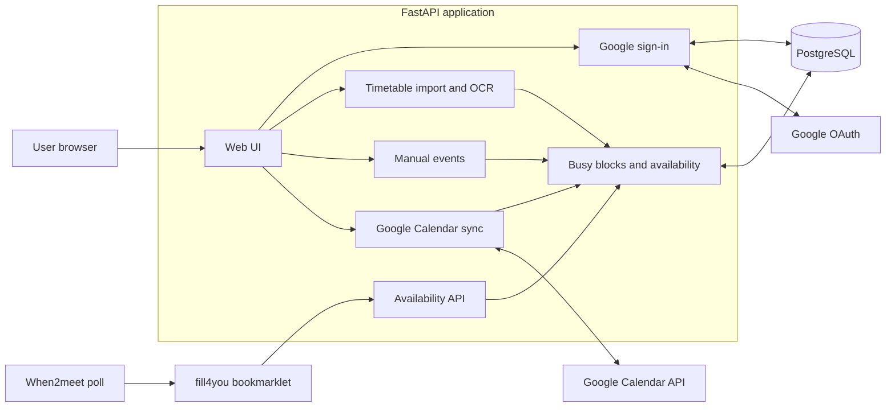

# fill4you

fill4you automatically prepares a when2meet availability first draft for you, resolved from a timetable, Google Calendar, and manually entered busy time.

## Features

- Everytime timetable image import PaddleOCR and rule-based recognition
- Google sign-in and read-only Google Calendar sync with calendar selection.
- Manual recurring or one-time events.
- Weekly schedule preview with a calendar-style UI
- Previewing and applying the first draft directly to when2meet, powered by bookmarklets.

## Architecture



## Project layout

| Path | Purpose |
| --- | --- |
| `app/` | FastAPI application, UI, availability logic, OCR, and integrations |
| `migrations/` | Alembic database migrations |
| `tests/` | Application tests |
| `compose.yaml` | Local Docker Compose stack |
| `compose.prod.yaml` | Cloudflare Tunnel production stack |

## Run locally

```bash
cp .env.example .env
docker compose up --build
```

Open `http://localhost:8000`.

## Production

```bash
cp .env.prod.example .env
docker compose --env-file .env -f compose.prod.yaml up -d
```

Set the Cloudflare Tunnel public-hostname service to `http://app:8000`. Fill the server-local `.env` with production secrets and the public HTTPS hostname before starting the stack.

## Test

```bash
uv run pytest -q
```
